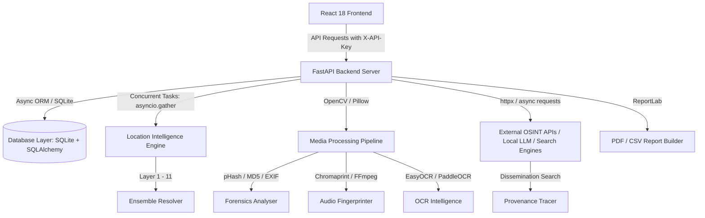

# HELIX Forensic Engine

[](https://opensource.org/licenses/MIT)
[](https://www.python.org/)
[](https://react.dev/)
[](https://fastapi.tiangolo.com/)
[](https://tailwindcss.com/)
[](http://makeapullrequest.com)

Helix Forensic Engine is a state-of-the-art, enterprise-grade digital forensics and Open Source Intelligence (OSINT) web application designed for geolocating digital footprints, auditing media evidence integrity, and correlating sparse geographic signals.

Developed for security researchers, law enforcement agencies, and digital forensic analysts, Helix automates the collection and correlation of EXIF metadata, language patterns, social activity schedules, timezone distributions, image compression mutations, and global media dissemination pathways.

---

## 🎯 Problem Solved
When conducting digital investigations, analysts are faced with sparse, fragmented information scattered across media assets and social profiles. Manual correlation of timezone headers, language scripts, metadata, and IP locations is slow and prone to errors. Helix solves this by providing:
*   **Unified Ingestion**: Simultaneous analysis of media files (images/videos), social media handles, and network URLs.
*   **Ensemble Location Scoring**: A multi-layered geographic extraction pipeline that aggregates sparse signals into a single, high-confidence target location.
*   **Dissemination and Provenance Tracking**: Automated extraction of visual/audio fingerprints and scene boundaries to trace how a file propagated across platforms.
*   **Evidence Chain Integrity**: Automated SQLite schema logging for Cases, Analysis Sessions, Audit Logs, Fingerprints, and Occurrences, exportable to court-admissible PDF reports.

---

## 🚀 Key Features

*   **🌐 Multi-Layered Location Intelligence (11 Layers)**:
    *   *L0 Snowflake*: Geographic signal parsing from unique platform IDs.
    *   *L1 Explicit*: Extraction of declared locations in profiles.
    *   *L2 NLP/NER*: Entity recognition identifying landmarks, cities, and countries in text.
    *   *L3 Timezone*: Profile posting frequency histograms mapping target sleep/wake cycles to UTC offsets.
    *   *L4 Language*: Character-script analysis (Hiragana, Katakana, Kanji, Korean Hangul, Arabic, Thai) with custom weightings.
    *   *L5 Local Context*: Slang, idioms, and terminology parsing (e.g. Edomae sushi matching for Japanese context).
    *   *L6 Website DNS*: Resolver analytics mapping domains to host nations.
    *   *L8 EXIF*: Camera GPS coordinate extraction.
    *   *L9 Visual*: Local Vision-Language AI captioning for environment details.
    *   *L10/L11 Social & Cross-Platform*: Correlation of social networks and cross-platform handles.
    *   *L7 Ensemble*: Aggregated scoring using a weighted matrix to calculate target country and confidence.
*   **📷 Advanced Media Forensics & Integrity**:
    *   Generates cryptographic MD5/SHA-256 hashes and Perceptual Hashes (pHash) to detect tamper history.
    *   Builds **Mutation Trees** mapping compression loss, resolution shifts, and cross-platform propagation changes.
    *   Extracts EXIF headers and processes video container metadata using OpenCV.
*   **🔊 Audio Fingerprinting**:
    *   Generates unique audio fingerprints using Chromaprint (`fpcalc`) signature analysis.
    *   Supports FFmpeg raw mono stream extraction & SHA-256 hashing as a fallback.
    *   Implements a robust metadata-based pseudo-hash fallback for environments without binaries.
*   **🔍 OCR Intelligence & Entity Extraction**:
    *   Performs dynamic OCR on keyframes using PaddleOCR or EasyOCR.
    *   Extracts structural patterns (usernames, hashtags, URLs, domains, phone numbers, and location names) from visual text.
    *   Identifies platform watermarks and brand logos (CNN, BBC, Telegram, TikTok, X, JR East).
*   **🕸️ Global Dissemination & Provenance Tracking**:
    *   Runs async tracing queries across external search providers (Google Lens, Bing, Yandex, Serper) and internal databases.
    *   Features a **5-Signal Weighted Forensic Similarity Engine**:
        *   40% Keyframe Similarity (via Scene Detection -> Entropy Ranking -> pHash Deduplication)
        *   25% Aggregate Video pHash
        *   20% Scene Sequence Alignment
        *   10% Duration Similarity
        *   5% Metadata Similarity
    *   Classifies mutations dynamically (Exact Duplicate, Re-Encoded, Trimmed, Extended, Subtitle Added, Cropped, Resized, Watermarked).
    *   Generates interactive provenance graphs and chronological timelines in the UI.
*   **💼 Secure Case Management**:
    *   Structured tracking of forensic sessions grouped under specific investigation cases.
    *   Strict file upload validations (100MB limit, verified MIME types, safe storage path mappings).
*   **📊 Interactive Dashboards**:
    *   Dynamic Leaflet map mapping geo-coordinates, GPS nodes, and signal pins.
    *   Recharts visualization for Timezone Histograms and Radar Signal break-downs.
    *   Dissemination Graph visualizer representing the media's lifecycle.
*   **📄 Professional Exporters**:
    *   Generates comprehensive, court-admissible PDF reports (using ReportLab) and raw CSV metadata tables.

---

## 🏗️ Architecture Overview

Helix runs on a decoupled, asynchronous client-server model optimized for local execution and scalability:



### Technical Breakdown:
*   **Frontend**: Built with React 18, Vite 5, and Tailwind CSS. State management handles session recovery (`localStorage`) and asynchronous XHR progress hooks. Maps are rendered client-side using Leaflet. The dissemination graph is visualized interactively.
*   **Backend**: Python 3.13 service built on FastAPI. It handles operations asynchronously (`async/await`) and leverages SQLAlchemy's async sqlite driver (`aiosqlite`).
*   **Caching & Security**: Employs TTL caching (`cachetools`) for heavy API requests. Enforces active CORS lockouts, SSRF validation for URL analysis, and HTTP header authentication.

---

## 📂 Project Structure

```
Searchengine/
├── backend/
│   ├── providers/                # Custom search provider integrations (Google Lens, Bing, Yandex)
│   ├── uploads/                  # Secure directory for forensic assets
│   ├── audio_fingerprint.py      # Audio fingerprinting & stream hashing pipeline
│   ├── backend.py                # FastAPI app initialization, middleware, and location geolocator
│   ├── db.py                     # SQLAlchemy database models (Case, Session, TraceJob, Fingerprint, Occurrences)
│   ├── media_trace_router.py     # Endpoints for global trace jobs & URL ingestion
│   ├── media_trace_service.py    # Keyframe selection, similarity matching, and propagation logic
│   ├── ocr_intelligence.py       # EasyOCR/PaddleOCR parser and logo/watermark extractor
│   ├── test_api.py               # Integration tests for FastAPI endpoints
│   ├── test_japanese.py          # Script tests for Japanese script analysis
│   ├── test_media_trace.py       # Integration tests for media tracing pipeline
│   ├── test_scrapebadger.py      # Mocks and unit tests for ScrapeBadger profiles
│   ├── test_security.py          # SSRF and API Key validation test suites
│   ├── test_video_forensics.py   # Test suite for OpenCV frame extraction & forensics
│   ├── requirements.txt          # Python backend dependencies
│   └── .env                      # Local environment configuration
├── frontend/
│   ├── src/
│   │   ├── components/           # Modular React layout, maps, and UI elements
│   │   │   ├── layout/           # Sidebar and layout elements
│   │   │   └── tabs/             # Feature tabs (MediaForensics, DisseminationTracker, TimelineView, etc.)
│   │   ├── App.jsx               # Main React entry dashboard
│   │   ├── main.jsx              # React app mount point
│   │   └── index.css             # CSS entry point with Tailwind directives
│   ├── index.html                # HTML entry point with Leaflet styles
│   ├── package.json              # Frontend package definitions
│   ├── postcss.config.js         # PostCSS configuration file
│   └── tailwind.config.js        # Tailwind CSS styling configuration
└── README.md                     # This file
```

---

## ⚙️ Configuration & Environment Variables

Create a `.env` file inside the `backend/` directory to manage local services and API keys:

```ini
# --- Server Configurations ---
SERVER_HOST=127.0.0.1
SERVER_PORT=8000
API_KEY=your-secure-backend-api-key
CORS_ORIGINS=http://localhost:5173,http://127.0.0.1:5173

# --- Database Setup ---
# Default fallback: sqlite+aiosqlite:///backend/helix.db
DATABASE_URL=sqlite+aiosqlite:///helix.db

# --- External OSINT & Geocoding API Keys ---
SERPER_API_KEY=your_serper_key_here
OPENCAGE_API_KEY=your_opencage_key_here
SCRAPEBADGER_API_KEY=your_scrapebadger_key_here
GITHUB_TOKEN=your_github_personal_token

# --- Local AI Configuration (LM Studio / Ollama) ---
LM_STUDIO_URL=http://127.0.0.1:1234/v1
MODEL_VISION=moondream-2b-2025-04-14
MODEL_TEXT=qwen2.5-coder-1.5b-instruct
LM_STUDIO_API_KEY=lm-studio
```

---

## 🛠️ Installation & Setup

### Prerequisites
*   Python 3.12 or 3.13
*   Node.js (v18 or higher)
*   npm (v9 or higher)

### 1. Backend Setup
1.  Navigate to the `backend/` folder:
    ```bash
    cd backend
    ```
2.  Create and activate a Python virtual environment:
    ```bash
    python -m venv venv
    # On Windows:
    .\venv\Scripts\activate
    # On macOS/Linux:
    source venv/bin/activate
    ```
3.  Install the backend dependencies:
    ```bash
    pip install -r requirements.txt
    ```
4.  Initialize your environment variables by setting up your `.env` file.
5.  Start the FastAPI server:
    ```bash
    python -m uvicorn backend:app --reload --host 127.0.0.1 --port 8000
    ```

### 2. Frontend Setup
1.  Navigate to the `frontend/` folder:
    ```bash
    cd ../frontend
    ```
2.  Install the required npm packages:
    ```bash
    npm install
    ```
3.  Start the Vite React development server:
    ```bash
    npm run dev
    ```
4.  Open your browser and navigate to `http://localhost:5173`.

---

## 🧪 Running the Test Suite

Helix contains a comprehensive test suite covering API endpoints, case CRUD logic, async profile fetching, security mechanisms, and media propagation.

To run the backend tests:
1.  Activate the virtual environment inside `backend/`.
2.  Execute `pytest`:
    ```bash
    pytest
    ```

---

## 🔒 Security & Privacy Considerations
Helix is designed with forensic security as a core pillar:
*   **SSRF Protection**: All target URL submissions pass through strict host resolution and private IP range blockers to prevent internal network probing.
*   **Authorization Lockout**: All API endpoints require an `X-API-Key` header matching the backend `.env` configuration.
*   **Input Sanitization**: File uploads are restricted to specific allowed extensions (MP4, PNG, JPG, JPEG, WEBP) and files are validated up to a strict 100MB limit. MD5/pHash generation verifies file contents.
*   **Audit Trail Logs**: Database audit logs (`audit_logs` table) record all operations, actions, timestamps, and request IDs to preserve the chain of custody.

---

## 📈 Performance & Scalability
*   **Concurrent Geolocation Execution**: Geolocation layers are requested concurrently using `asyncio.gather` to minimize thread blocking and API response latencies.
*   **TTL Cached Geocoding**: Avoids rate-limit depletion and speeds up query response times by caching social profiles and coordinate geocodes.
*   **On-Demand Local Inference**: Local Vision models (via LM Studio) are queried asynchronously with timeouts, allowing fallback configurations if offline.


